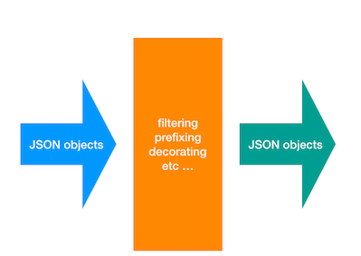

## boostd

poor man's stream processor LOL

The main components are: input stream/source, the transformation stage and the output.

`Extract -> Transform -> Load/store`

By default, it reads from STDIN and outputs to STDOUT.

A tranform function callback can do the following operations:

* reject an object based on a value.
* add a key value pair on an object
* remove a key from an object
* prefix a key with a string



## Usage

### CLI
```shell
$ git clone git@github.com:rpip/boost
$ cd boost && make deps && make
$ ./boostd -h
Usage of boostd:
  -n int
        Max number of concurrent OUT streamers (default 4)
  -r duration
        burst rate (default 100ms)
  -v    Enable Verbose logging (default true)


$ ./boostd -r 10ms < boost/testdata/ordered_driver_positions.json_dump
# OR
$ ./boostd < boost/testdata/ordered_driver_positions.json_dump
{"created_at":"2016-12-14 08:18:39","id":183,"lat":48.877550211971496,"lng":2.386344728436552}
{"created_at":"2016-12-14 08:18:43","id":846,"lat":48.95799309422942,"lng":2.5436685974891184}
{"created_at":"2016-12-14 08:18:47","id":10912,"lat":49.00975592361513,"lng":2.400408684983234}
{"created_at":"2016-12-14 08:18:52","id":10331,"lat":48.64559215187843,"lng":2.342777276025095}
{"created_at":"2016-12-14 08:18:54","id":1778,"lat":50.809599227526014,"lng":2.584064846519136}
```

### or assuming repo is at `github.com/rpip/boost`

``` shell
$ go get github.com/rpip/boost
$ boostd -h
Usage of boostd:
  -n int
        Max number of concurrent OUT streamers (default 4)
  -r duration
        burst rate (default 100ms)
  -v    Enable Verbose logging (default true)
```

### As a library

Transformers are callback functions that consume and perform state transformations upon delivery of these emitted messages. It can clean data, apply business rules or validation, filter etc.

A transformer takes in an object from the input stream and returns a tuple of the transformed item and an error if any. If there's an error in the returned tuple, we assume the object should be rejected.

```go
type Transformer func(Item) (*Result, error)
```

```go
func main() {
	ctx := context.Background()
	transformers := []boost.Transformer{reject, clean, prefix, decorate}
	pipe := boost.NewPipeline(ctx, os.Stdin, os.Stdout, transformers, time.Second/10,4, false)
	pipe.Run()
}

// transformers

// reject an object based on a value
func reject(res *boost.Result) (*boost.Result, error) {
	if res.Item["id"].(float64) == 557 {
		return res, errors.New("")
	}
	return res, nil
}

// add a key value pair on an object
func decorate(res *boost.Result) (*boost.Result, error) {
	res.Item["foo"] = "bar"
	return res, nil
}
```


### Docker

```shell
$ make docker
$ cat boost/testdata/ordered_driver_positions.json_dump | docker run -i rpip/boost -r 10ms
{"created_at":"2016-12-14 08:18:39","id":183,"lat":48.877550211971496,"lng":2.386344728436552}
{"created_at":"2016-12-14 08:18:43","id":846,"lat":48.95799309422942,"lng":2.5436685974891184}
{"created_at":"2016-12-14 08:18:47","id":10912,"lat":49.00975592361513,"lng":2.400408684983234}
{"created_at":"2016-12-14 08:18:52","id":10331,"lat":48.64559215187843,"lng":2.342777276025095}
{"created_at":"2016-12-14 08:18:54","id":1778,"lat":50.809599227526014,"lng":2.584064846519136}
{"created_at":"2016-12-14 08:18:57","id":1874,"lat":48.95911833908978,"lng":2.240932341443888}
{"created_at":"2017-01-14 08:19:00","id":1295,"lat":48.9071900873022,"lng":2.4638371736867906}

$ # OR
$ docker run -i rpip/boost -r 10ms < boost/testdata/ordered_driver_positions.json_dump
```


### future improvemnts

some ideas i'll hack on when i get some time:

* more performant data structures
* configurable input and output sources via CLI
* support different types of input and outputs: HTTP(s), Kafka, File, MQTT, Redis, S3, Elasticsearch etc
* multiple sources
* configurable OUT push strategy
* distributed maybe haha
